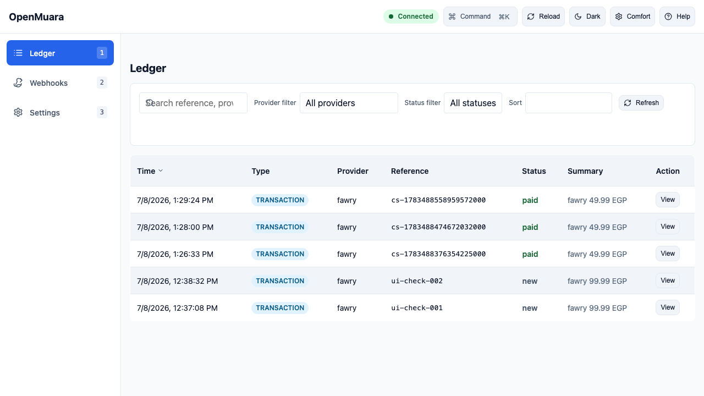
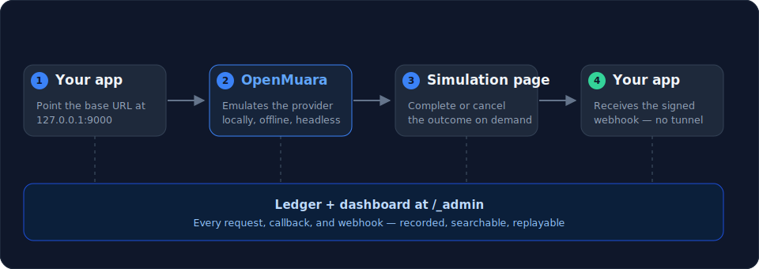
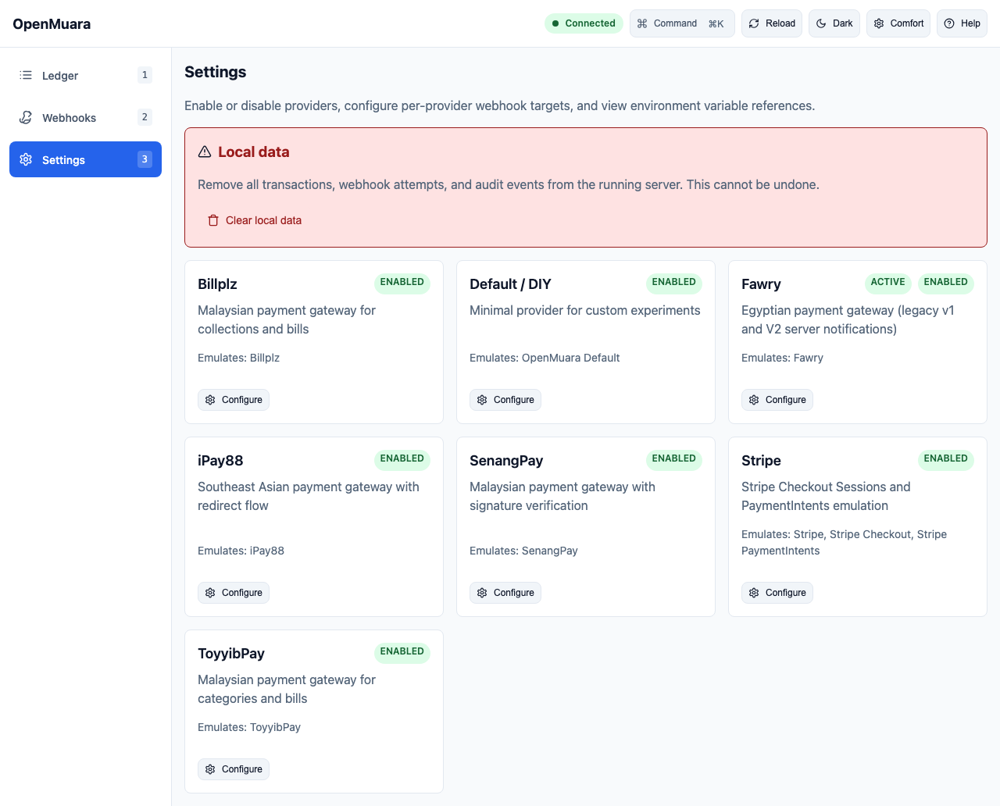

# OpenMuara

[](https://github.com/Gr3gg0r/openmuara/actions/workflows/ci.yml)
[](https://github.com/Gr3gg0r/openmuara/actions/workflows/release.yml)
[](runbooks/quality-gates.md)
[](https://github.com/Gr3gg0r/openmuara/pkgs/container/openmuara)
[](LICENSE)
[](https://scorecard.dev/viewer/?uri=github.com/Gr3gg0r/openmuara)

Run the providers your app integrates with, locally. OpenMuara emulates checkout,
callback, and webhook flows on your own machine — offline, fast, and headless.
No live accounts, no tunnels, no surprise charges.

**Documentation:** [https://gr3gg0r.github.io/openmuara/](https://gr3gg0r.github.io/openmuara/)



## How it works

1. **Start OpenMuara.** `muara init && muara start` — it listens on `127.0.0.1:9000`.
2. **Point your app at it.** Use `http://127.0.0.1:9000` as the base URL instead of the live provider.
3. **Run the flow.** Trigger a charge, complete it on the simulation page, and
   watch the callback, webhook, and ledger update in one dashboard at `/_admin`.



### Headless by design

The dashboard is optional — the `muara` CLI drives every step, so the whole
flow drops straight into scripts and CI:

```bash
# start the local engine
muara init --defaults
muara start

# force an outcome, then fire the signed webhook — no browser needed
muara scenario success tx-123
muara webhook replay tx-123

# script it all — JSON output for CI
muara transaction list --json
```

Full reference in [`docs/cli.md`](docs/cli.md).

## Why OpenMuara

Integrations like these are painful to test. Sandboxes are limited or nonexistent,
every provider speaks a slightly different dialect, and webhooks — the part that
actually moves money in your app — cannot be triggered on demand from your laptop.

OpenMuara emulates providers locally: checkout flows, signatures, callbacks, and
webhooks, all offline and headless. Point your test app at it and run the full
checkout-to-webhook cycle on your own machine.

### The name

*Muara* is Malay for "estuary" — where the river meets the sea. I am from Muar,
a town in Johor, Malaysia, and the name carries both meanings for me. Payment
providers across Southeast Asia are fragmented and thinly documented, and webhook
debugging was a constant struggle on every project I touched. OpenMuara is the
tool that struggle produced: a calm layer where your app meets the messy world
of payments, before either of you goes near the real thing.

## Install

### Recommended: release binary

Use the install script (macOS / Linux):

```bash
curl -sSL https://raw.githubusercontent.com/Gr3gg0r/openmuara/main/scripts/install.sh | bash
```

Or download a pre-built binary for your platform from the
[GitHub Releases](https://github.com/Gr3gg0r/openmuara/releases) page and extract it.

### From source

Clone the repo and build locally:

```bash
git clone https://github.com/Gr3gg0r/openmuara.git
cd openmuara
go build -o bin/muara ./cmd/muara
./bin/muara init
./bin/muara start
```

Or install directly with Go:

```bash
go install github.com/Gr3gg0r/openmuara/cmd/muara@latest
```

### Docker

A container image is published to `ghcr.io/gr3gg0r/openmuara` on every release:

```bash
docker run --rm -p 127.0.0.1:9000:9000 \
  -e MUARA_SERVER_HOST=0.0.0.0 \
  -v "$(pwd)/.muara:/app/.muara" \
  ghcr.io/gr3gg0r/openmuara:latest
```

Or use Docker Compose, which initializes a default config on first start:

```bash
docker compose up
```

## Quick Start

```bash
# Initialize a local workspace
muara init

# Start the server
muara start
```

The server listens on `127.0.0.1:9000` by default. Open
`http://127.0.0.1:9000/_admin` to see the ledger.

For guided paths tailored to developers, AI agents, testers, and contributors,
see [`docs/quickstart.md`](docs/quickstart.md).

## Examples

A maintained checkout-store example lives in [`examples/checkout-store/`](examples/checkout-store/):

```bash
cd examples/checkout-store/web
npm install && npm run build    # build React + DaisyUI SPA

cd ..
docker compose up --build -d    # OpenMuara + Mailpit
go run .                        # checkout store on :8080
```

It demonstrates a React + TypeScript + Vite + DaisyUI product landing page and
checkout SPA, one-time payments across multiple providers, outgoing webhooks,
and Mailpit email. See [`examples/checkout-store/README.md`](examples/checkout-store/)
for details.

## Configuration

OpenMuara reads `.muara/config.yml` at startup. Run `muara init` to create it from the bundled
defaults, or copy `muara.yml.example` and edit:

- `server.host` / `server.port` — bind address
- `log.level` — `debug`, `info`, `warn`, `error`
- `persistence.type` — `sqlite` (default) or `memory`
- `providers.<name>.enabled` — activate provider plugins
- `webhook.url` — local URL to receive outgoing webhooks
- `cors` / `csrf` — optional security settings

Environment variables override YAML values with the `MUARA_` prefix, e.g. `MUARA_SERVER_PORT=8080`.

See [`docs/operations.md`](docs/operations.md) for deployment, observability, and runbooks.

- `GET /healthz` — liveness probe.
- `GET /readyz` — readiness probe, lists enabled and available providers.
- Admin API responses (`/_admin/transactions`, `/_admin/webhooks`) are paginated as `{ limit, offset, results }`.
- Request body size is limited to 1 MiB by default.

## Providers

OpenMuara ships contract-faithful emulations — request and response shapes,
signature verification, and escape pages to simulate outcomes — so integration
code behaves the same against OpenMuara as it would against the real sandbox.



**Supported today:** Stripe, Fawry, SenangPay, iPay88, Billplz, and ToyyibPay.

**On the roadmap (help wanted):** Adyen, Xendit, and more major Southeast Asia
platforms. Providers are plugins — see
[`docs/contributing-providers.md`](docs/contributing-providers.md) to add yours.

See [`docs/providers/`](docs/providers/) for per-provider guides and worked
examples.

## Development Commands

```bash
task check      # run fmt, vet, lint, tests, coverage, and UI checks
task test       # run tests with race detector and coverage
task coverage   # enforce 80% minimum coverage
task lint       # run golangci-lint
task vuln       # run govulncheck if installed
task security   # run gosec if installed
task secrets    # run gitleaks if installed
task smoke      # run the E2E smoke test
task ui:build   # build the dashboard SPA into the Go embed directory
task ui:test    # run dashboard unit tests
task dev        # run Go server + Vite dev server with HMR
./bin/muara doctor
```

The dashboard is a Vite + Preact SPA in `web/dashboard/`. Built assets are
embedded into the Go binary at `internal/ui/dashboard-dist/`. A tracked
placeholder `internal/ui/dashboard-dist/index.html` lets `go build ./...` work
on a fresh clone; run `task ui:build` to overwrite it with the real SPA. Do not
commit generated files inside `internal/ui/dashboard-dist/`.

The dashboard and all provider simulation pages support light and dark modes.
The theme follows the OS preference by default and can be toggled from the
dashboard header or persists automatically across pages via `localStorage`.

## Local Quality Gates

All commits should pass `task check`. Optionally install pre-commit hooks:

```bash
pre-commit install
pre-commit run --all-files
```

See [`runbooks/quality-gates.md`](runbooks/quality-gates.md) for the full local quality workflow.

## Security

OpenMuara is local-first by default: it binds to `127.0.0.1` and does not require admin
authentication. For CI/CD or shared environments, enable the opt-in hardening controls:

```yaml
# .muara/config.yml
server:
  host: 0.0.0.0
  tls_cert: /path/to/cert.pem
  tls_key: /path/to/key.pem

admin:
  enabled: true
  username: admin
  password_hash: "$2a$10$..."  # muara security hash-password

rate_limit:
  enabled: true
  requests_per_minute: 200

hardened: true
```

- `/_admin/*` and admin JSON APIs support HTTP Basic Auth or a bearer token.
- Provider emulation endpoints remain public and contract-faithful.
- Security features are lazy-initialized and add no overhead when disabled.

Helpers:

```bash
muara security hash-password --password mypassword
muara security gen-cert --host localhost --cert-out cert.pem --key-out key.pem
muara security audit
```

See [`docs/security.md`](docs/security.md) for the full hardening guide.

## Webhooks

OpenMuara can dispatch outgoing webhooks to a local URL so you can test your
webhook handler without a tunnel. Configure `webhook.url` in `.muara/config.yml`,
then use the escape pages or `muara webhook` commands to inspect and replay.

See [`docs/webhooks.md`](docs/webhooks.md) for details.

## OpenAPI

The API spec is available at [`docs/openapi.yaml`](docs/openapi.yaml) and served live at `GET /openapi.yaml`.

## About emulation

Provider endpoints follow the documented contracts of the gateways they
emulate, including signature schemes. OpenMuara is intended for local
integration testing, not production payment processing, and never proxies
traffic to real provider endpoints.

## Governance and Security

- [`GOVERNANCE.md`](GOVERNANCE.md) — maintainer roles and decision-making.
- [`SECURITY.md`](SECURITY.md) — reporting security issues.
- [`CODE_OF_CONDUCT.md`](CODE_OF_CONDUCT.md) — community standards.

## Contributing

We welcome contributions. Please read [CONTRIBUTING.md](CONTRIBUTING.md) and
[CODE_OF_CONDUCT.md](CODE_OF_CONDUCT.md) before participating.

## License

MIT
